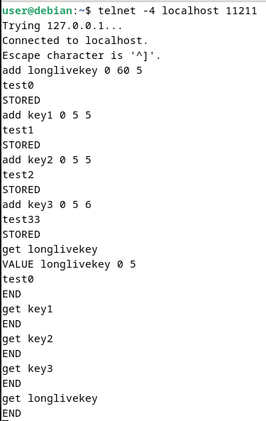

# Домашнее задание к занятию "`Кеширование Redis/memcached`" - `Алексеев Алексндр`

---
### Задание 1. Кеширование
Приведите примеры проблем, которые может решить кеширование.
Приведите ответ в свободной форме.

#### Ответ: 
Кеширование позволяет получить преимущества:
1. Экономия ресурсов: при повторном вызове одной и той же функции (запроса) исключается повторное обращение к ресурсам базы данных и вычислительным мощностям, особенно в случае "тяжелых запросов";
2. Повышение производительности - как следствие п.1.
3. Ускорение ответа - как следствие п.1 и 2
Указанные преимущества находят выражение в устойчивости системы при работе в длительном периоде повышенной нагрузки.

### Задание 2. Memcached
Установите и запустите memcached.
Приведите скриншот systemctl status memcached, где будет видно, что memcached запущен.

#### Ответ:

### Задание 3. Удаление по TTL в Memcached
Запишите в memcached несколько ключей с любыми именами и значениями, для которых выставлен TTL 5.
Приведите скриншот, на котором видно, что спустя 5 секунд ключи удалились из базы.

#### Ответ:

### Задание 4. Запись данных в Redis
Запишите в Redis несколько ключей с любыми именами и значениями.

Через redis-cli достаньте все записанные ключи и значения из базы, приведите скриншот этой операции.

Дополнительные задания (со звёздочкой*)
Эти задания дополнительные, то есть не обязательные к выполнению, и никак не повлияют на получение вами зачёта по этому домашнему заданию. Вы можете их выполнить, если хотите глубже разобраться в материале.

### Задание 5*. Работа с числами
Запишите в Redis ключ key5 со значением типа "int" равным числу 5. Увеличьте его на 5, чтобы в итоге в значении лежало число 10.

Приведите скриншот, где будут проделаны все операции и будет видно, что значение key5 стало равно 10.