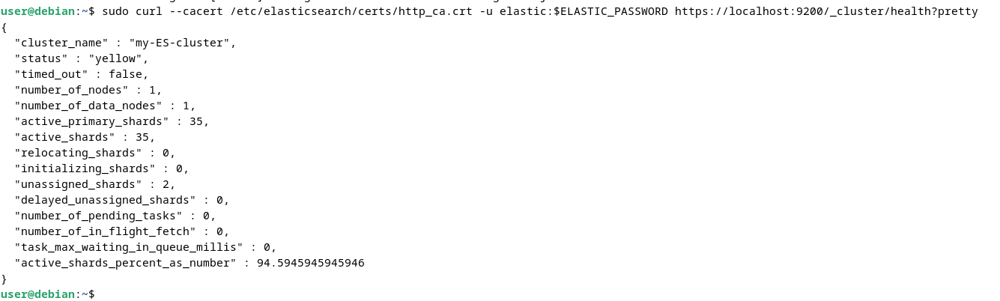
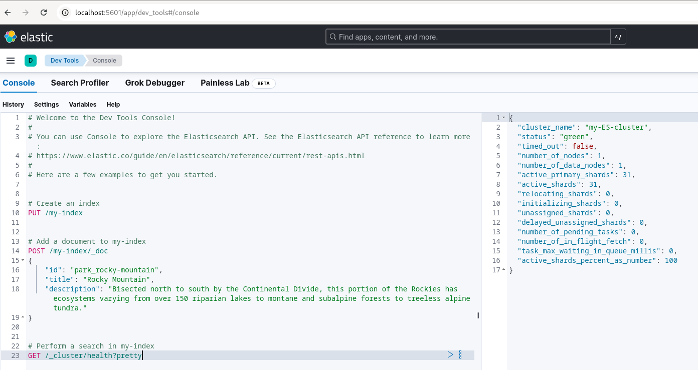
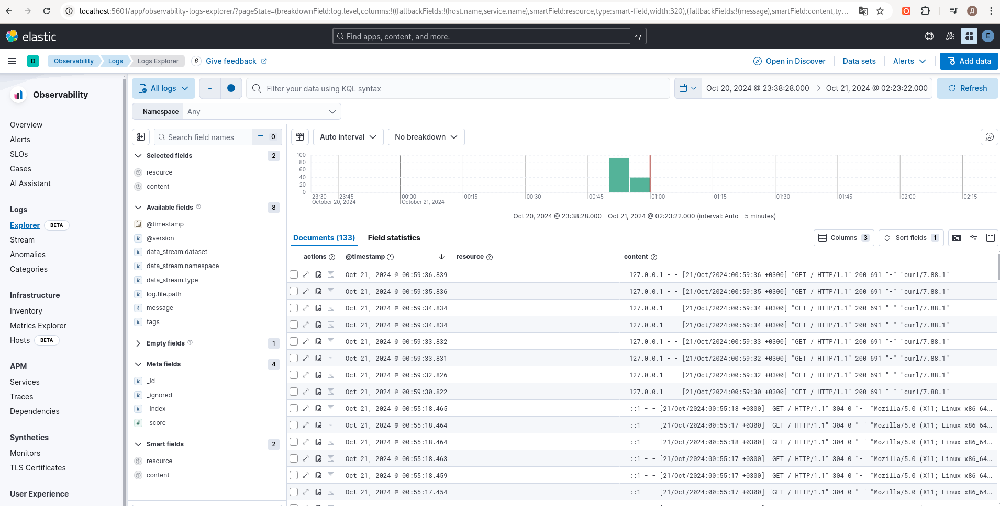

# Домашнее задание к занятию "`ELK`" - `Алексеев Алексндр`

### Задание 1. Elasticsearch
Установите и запустите Elasticsearch, после чего поменяйте параметр cluster_name на случайный.
Приведите скриншот команды 'curl -X GET 'localhost:9200/_cluster/health?pretty', сделанной на сервере с установленным Elasticsearch. Где будет виден нестандартный cluster_name.

#### Ответ:

user@debian:~$ sudo curl --cacert /etc/elasticsearch/certs/http_ca.crt -u elastic:$ELASTIC_PASSWORD https://localhost:9200/_cluster/health?pretty
{
  "cluster_name" : "my-ES-cluster",
  "status" : "yellow",
  "timed_out" : false,
  "number_of_nodes" : 1,
  "number_of_data_nodes" : 1,
  "active_primary_shards" : 35,
  "active_shards" : 35,
  "relocating_shards" : 0,
  "initializing_shards" : 0,
  "unassigned_shards" : 2,
  "delayed_unassigned_shards" : 0,
  "number_of_pending_tasks" : 0,
  "number_of_in_flight_fetch" : 0,
  "task_max_waiting_in_queue_millis" : 0,
  "active_shards_percent_as_number" : 94.5945945945946
}
user@debian:~$ 

### Задание 2. Kibana
Установите и запустите Kibana.
Приведите скриншот интерфейса Kibana на странице http://<ip вашего сервера>:5601/app/dev_tools#/console, где будет выполнен запрос GET /_cluster/health?pretty.

#### Ответ:

### Задание 3. Logstash
Установите и запустите Logstash и Nginx. С помощью Logstash отправьте access-лог Nginx в Elasticsearch.
Приведите скриншот интерфейса Kibana, на котором видны логи Nginx.

#### Ответ:

### Задание 4. Filebeat.
Установите и запустите Filebeat. Переключите поставку логов Nginx с Logstash на Filebeat.
Приведите скриншот интерфейса Kibana, на котором видны логи Nginx, которые были отправлены через Filebeat.

#### Ответ:

Дополнительные задания (со звёздочкой*)
Эти задания дополнительные, то есть не обязательные к выполнению, и никак не повлияют на получение вами зачёта по этому домашнему заданию. Вы можете их выполнить, если хотите глубже шире разобраться в материале.

### Задание 5*. Доставка данных
Настройте поставку лога в Elasticsearch через Logstash и Filebeat любого другого сервиса , но не Nginx. Для этого лог должен писаться на файловую систему, Logstash должен корректно его распарсить и разложить на поля.

Приведите скриншот интерфейса Kibana, на котором будет виден этот лог и напишите лог какого приложения отправляется.