# Домашнее задание к занятию "`Очереди RabbitMQ`" - `Алексеев Александр`

---
### Задание 1. Установка RabbitMQ
Используя Vagrant или VirtualBox, создайте виртуальную машину и установите RabbitMQ. Добавьте management plug-in и зайдите в веб-интерфейс.
Итогом выполнения домашнего задания будет приложенный скриншот веб-интерфейса RabbitMQ.

#### Ответ:
``` bash
user@debian:~/HW-11/files-04-rmq$ ~/python-venv/bin/python -m pip install pika --upgrade
Requirement already satisfied: pika in /home/user/python-venv/lib/python3.11/site-packages (1.3.2)

user@debian:~$ sudo rabbitmq-plugins enable rabbitmq_management
Enabling plugins on node rabbit@debian:
rabbitmq_management
The following plugins have been configured:
  rabbitmq_management
  rabbitmq_management_agent
  rabbitmq_web_dispatch
Applying plugin configuration to rabbit@debian...
The following plugins have been enabled:
  rabbitmq_management
  rabbitmq_management_agent
  rabbitmq_web_dispatch

started 3 plugins.
```
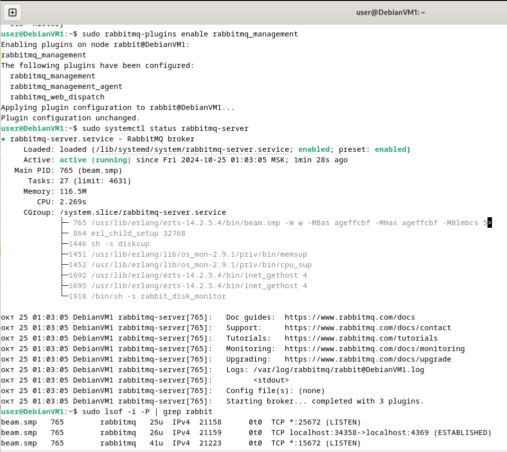
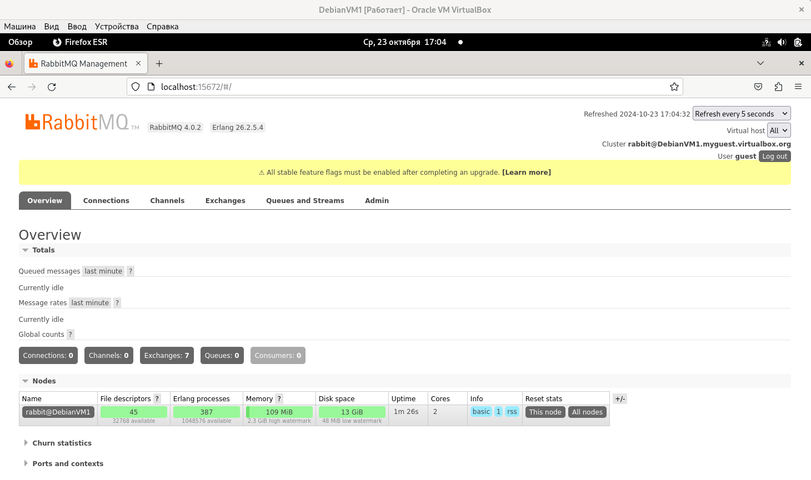

---
### Задание 2. Отправка и получение сообщений
Используя приложенные скрипты, проведите тестовую отправку и получение сообщения. Для отправки сообщений необходимо запустить скрипт producer.py.

Для работы скриптов вам необходимо установить Python версии 3 и библиотеку Pika. Также в скриптах нужно указать IP-адрес машины, на которой запущен RabbitMQ, заменив localhost на нужный IP.

``` bash
$ pip install pika
```
Зайдите в веб-интерфейс, найдите очередь под названием hello и сделайте скриншот. После чего запустите второй скрипт consumer.py и сделайте скриншот результата выполнения скрипта

В качестве решения домашнего задания приложите оба скриншота, сделанных на этапе выполнения.
Для закрепления материала можете попробовать модифицировать скрипты, чтобы поменять название очереди и отправляемое сообщение.

#### Ответ:

[Отправка](files-04-rmq/producer.py)


[Приём](files-04-rmq/consumer.py)

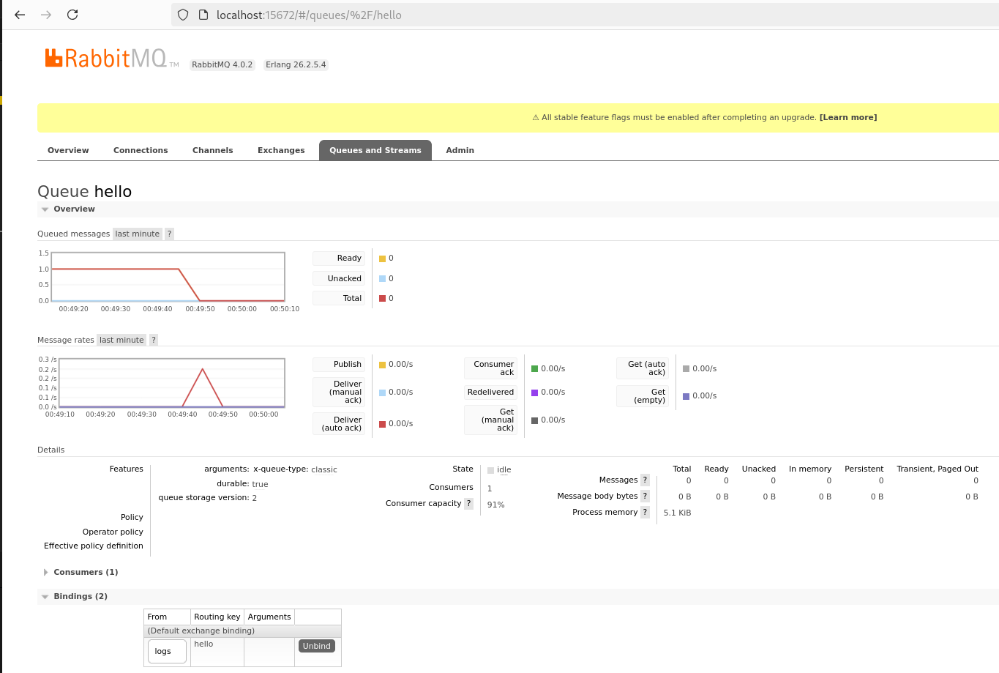
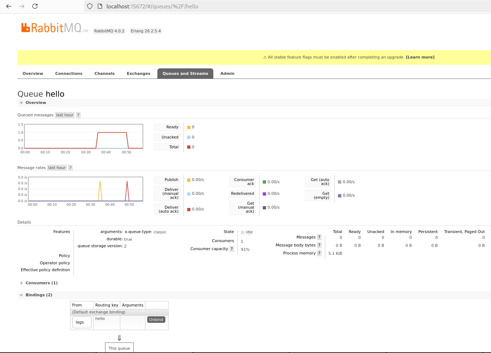

---
### Задание 3. Подготовка HA кластера
Используя Vagrant или VirtualBox, создайте вторую виртуальную машину и установите RabbitMQ. Добавьте в файл hosts название и IP-адрес каждой машины, чтобы машины могли видеть друг друга по имени.

Пример содержимого hosts файла:
``` bash
$ cat /etc/hosts
192.168.0.10 rmq01
192.168.0.11 rmq02
```
После этого ваши машины могут пинговаться по имени.

Затем объедините две машины в кластер и создайте политику ha-all на все очереди.
В качестве решения домашнего задания приложите скриншоты из веб-интерфейса с информацией о доступных нодах в кластере и включённой политикой.
#### Ответ: "..создайте политику ha-all на все очереди" - видимо, версии 4.0.2 работает не так, а по-другому.
По всей видимости принцип работы с нодами в кластере поменялся начиная с версии 4.0.0.
Не первый раз сталкиваюсь с кривыми заданиями и отвратительно поданным материалом в "лекциях" на этом "курсе".
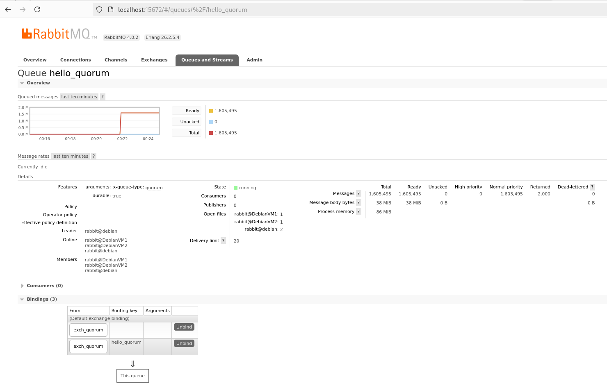

Также приложите вывод команды с двух нод:
``` bash
$ rabbitmqctl cluster_status
```
#### Ответ:
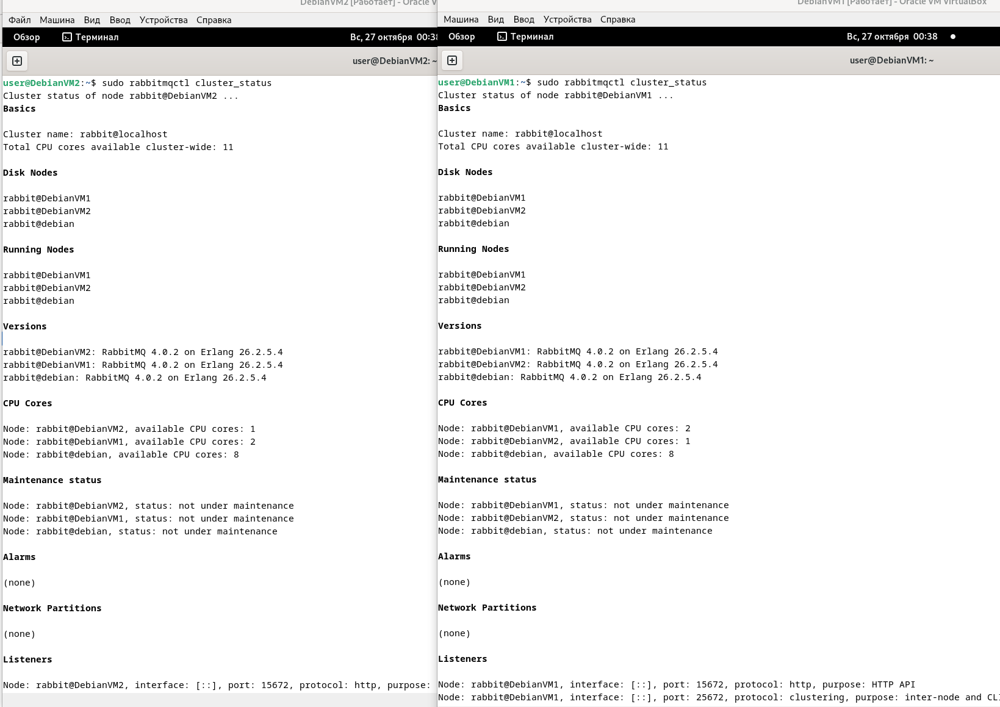

Для закрепления материала снова запустите скрипт producer.py и приложите скриншот выполнения команды на каждой из нод:
``` bash
$ rabbitmqadmin get queue='hello'
```
#### Ответ:
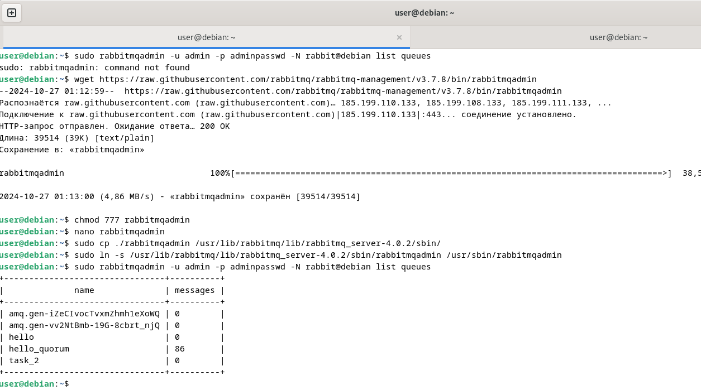
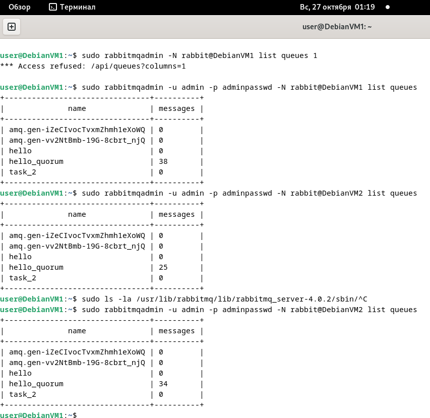
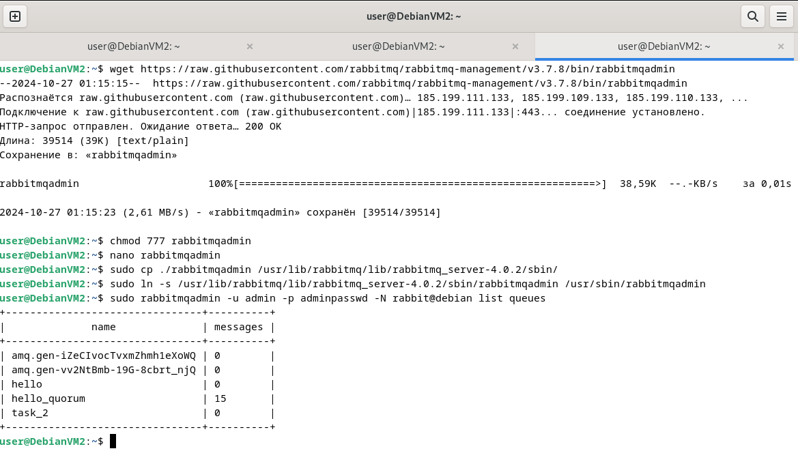

После чего попробуйте отключить одну из нод, желательно ту, к которой подключались из скрипта, затем поправьте параметры подключения в скрипте consumer.py на вторую ноду и запустите его.
Приложите скриншот результата работы второго скрипта.
#### Ответ:
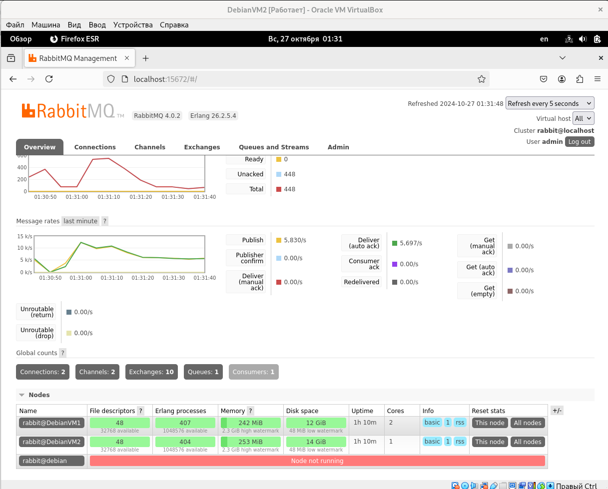
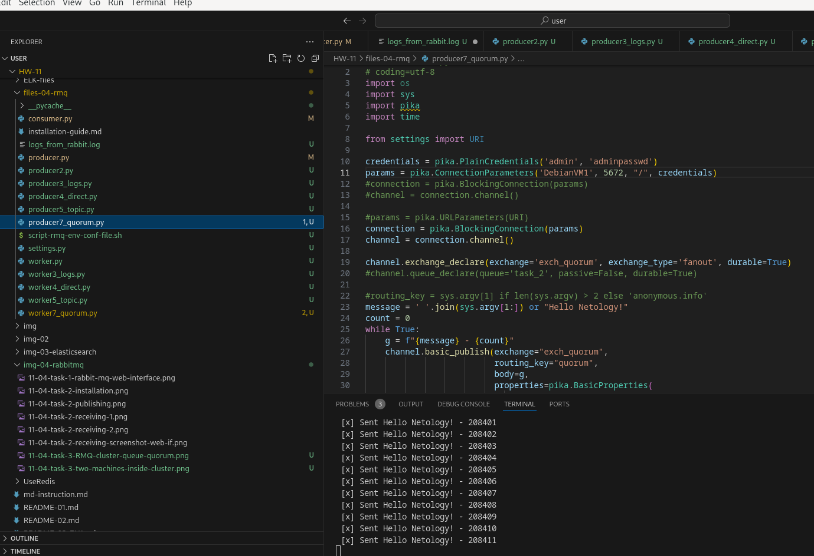
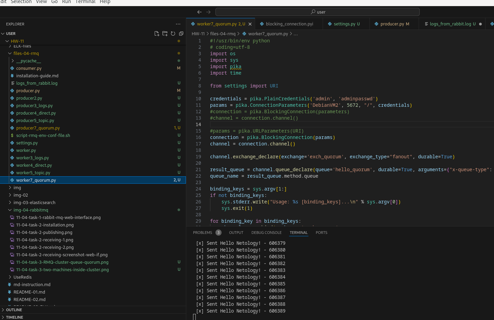
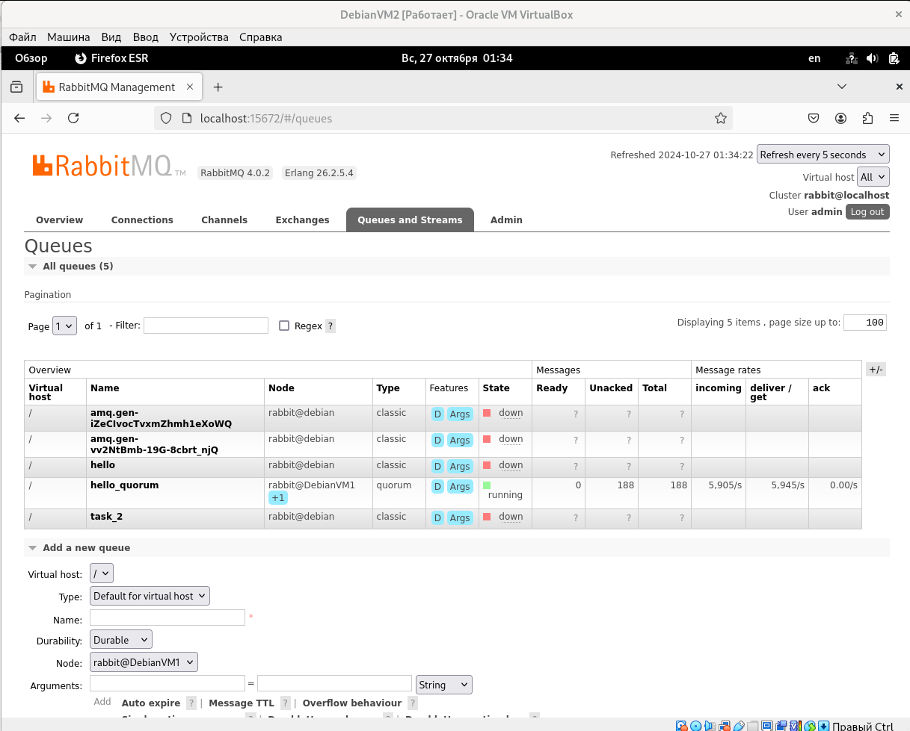


---

Дополнительные задания (со звёздочкой*)
Эти задания дополнительные, то есть не обязательные к выполнению, и никак не повлияют на получение вами зачёта по этому домашнему заданию. Вы можете их выполнить, если хотите глубже шире разобраться в материале.

### Задание 4*. Ansible playbook
Напишите плейбук, который будет производить установку RabbitMQ на любое количество нод и объединять их в кластер. При этом будет автоматически создавать политику ha-all.

Готовый плейбук разместите в своём репозитории.
